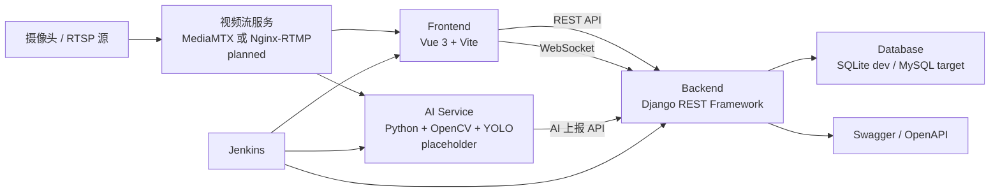
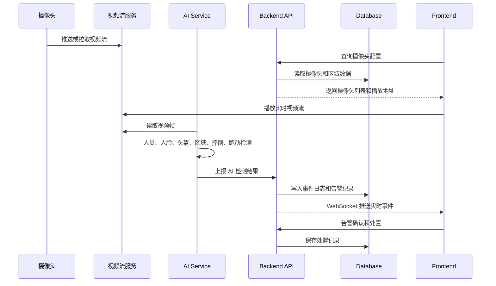
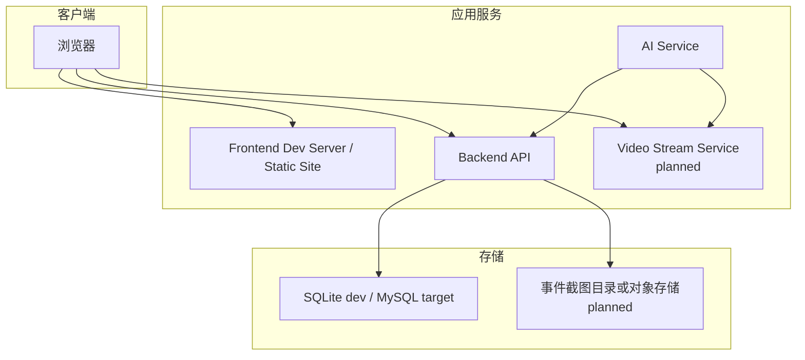

# 架构设计

## 总体架构

系统采用前后端分离和 AI 服务独立部署架构。前端负责页面展示和用户操作，后端负责业务 API、数据持久化、告警和日志管理，AI 服务负责视频帧读取和检测结果生成，视频流服务负责摄像头流接入和分发，数据库负责保存业务数据。

当前代码状态：

- `frontend`: Vue 3 + Vite 页面骨架已存在。
- `backend`: Django + DRF 项目、Swagger、健康检查和 placeholder API 已存在。
- `ai-service`: FastAPI 服务、健康检查、自动接口文档和 AI 模块 placeholder 已存在。
- `video-stream`: MediaMTX 或 Nginx-RTMP 为规划组件，当前未接入。
- `database`: 开发阶段 SQLite 已可用，目标为 MySQL。

## 系统架构图

## 服务关系

| 服务 | 职责 | 访问对象 | 当前状态 |
| --- | --- | --- | --- |
| Frontend | 页面展示、用户操作、REST 和 WebSocket 消费 | Backend API、视频流播放地址 | skeleton |
| Backend | 认证、业务管理、事件、告警、日志、数据持久化 | Database、Swagger、AI 上报入口 | placeholder |
| AI Service | 视频帧读取、目标检测、识别、事件上报 | 视频流服务、Backend API | placeholder |
| Video Stream | 摄像头接入、协议转换、流分发 | 摄像头、前端、AI 服务 | planned |
| Database | 保存用户、员工、摄像头、区域、事件、告警和考勤 | Backend | planned schema |
| Jenkins | 代码检查、构建和归档 | 仓库各服务 | skeleton |

## 数据流图

## 核心边界

1. 前端不直接访问数据库，只通过后端 REST API 和 WebSocket 获取业务数据。
2. AI 服务不直接写数据库，只通过后端 `ai-results` API 上报检测结果。
3. 视频流服务只负责流接入和分发，不承载业务状态。
4. 后端是业务规则、数据一致性和权限校验的唯一入口。
5. Swagger / OpenAPI 用于接口自描述，OpenSpec 用于需求和变更约束。

## 部署视图

