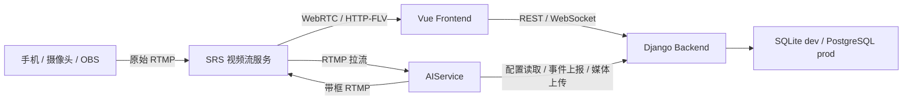
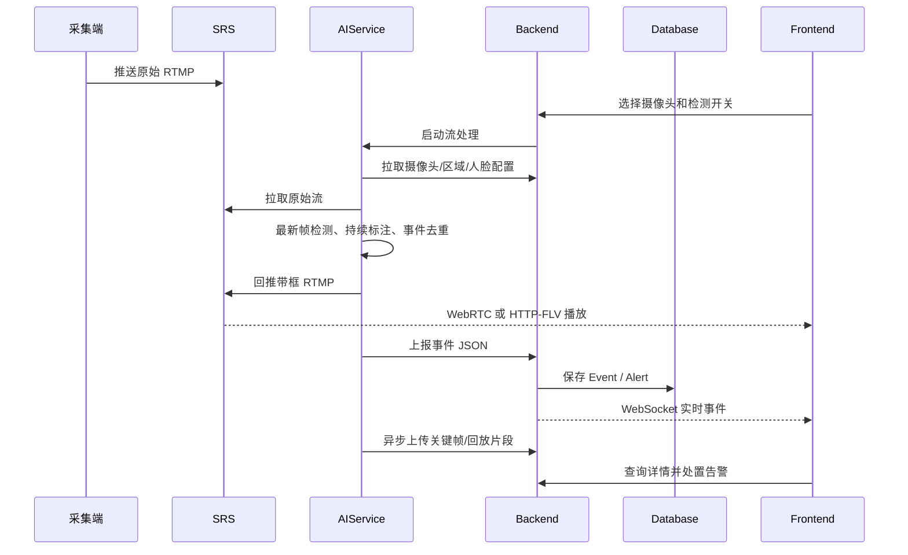
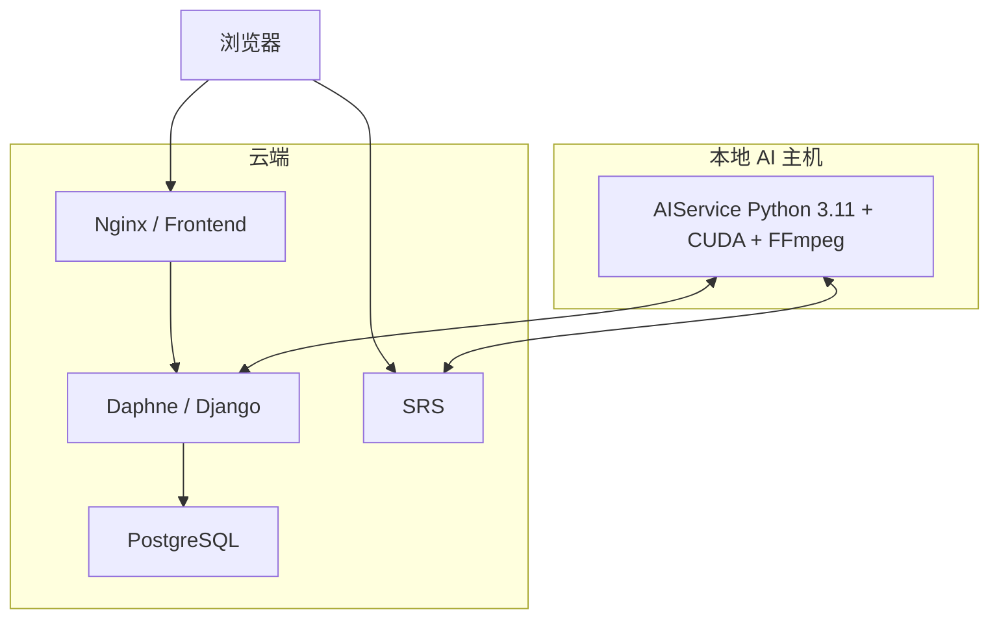

# 架构设计

## 总体架构

系统采用 Frontend、Backend、AIService、SRS 和 Database 解耦的架构。云端部署 Frontend、Backend 与 PostgreSQL；AIService 在具备 GPU、模型和视频链路的主机独立运行。

## 服务职责

| 服务 | 主要职责 | 状态 |
| --- | --- | --- |
| Frontend | 登录、管理页面、低延迟播放器、检测开关、实时事件、告警和日报 | 已实现 |
| Backend | 认证、业务 API、事件告警、WebSocket、媒体、日报和数据持久化 | 已实现 |
| AIService | 拉流、检测调度、画框、事件证据、RTMP 回推与性能指标 | 已实现 |
| SRS | 原始/带框流接入，RTMP、WebRTC、HTTP-FLV 协议分发 | 外部部署 |
| Database | 保存用户、员工、人脸、摄像头、区域、事件、告警和日报 | 已实现 |
| Jenkins | 校验、构建镜像、部署云端前后端与健康检查 | 已实现 |

## 实时视频与事件数据流

## 关键设计

1. 视频像素数据不经过 Backend；SRS 负责媒体分发，Backend 只管理业务状态。
2. 检测框由 AIService 直接绘制到输出帧，避免浏览器按结构化坐标二次同步。
3. AIService 输入与输出使用“只保留最新帧”策略，慢模型不会形成无界 FIFO 积压。
4. 人物检测始终开启；人脸、安全帽、摔倒和区域检测通过启动配置选择执行。
5. 事件媒体编码和上传使用有界后台队列，不阻塞实时帧处理。
6. Backend 通过 Django Channels 推送实时事件；生产多实例时应将内存 Channel Layer 替换为 Redis。

## 部署视图

生产 Compose 当前负责 PostgreSQL、Backend 和 Frontend。SRS 由视频环境独立维护，AIService 使用仓库 Python 3.11 环境独立运行。
