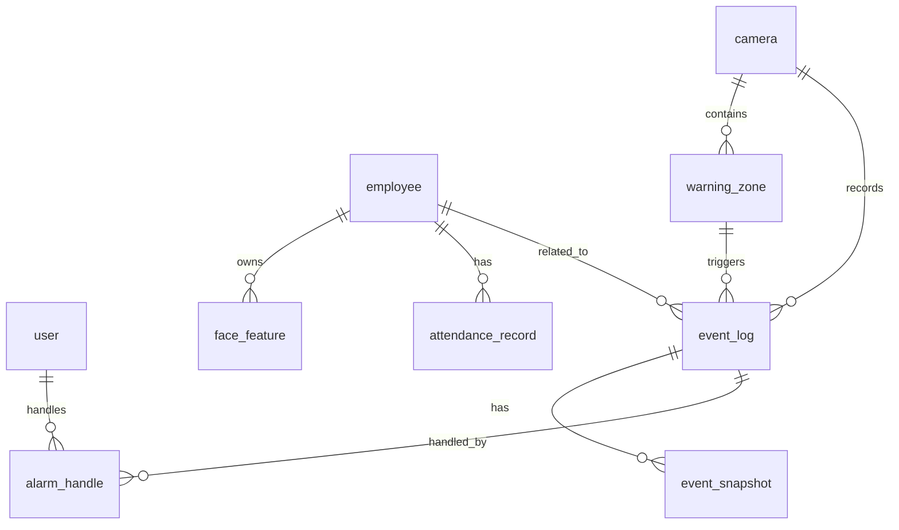

# 数据库设计

## 当前状态

当前后端使用 Django 默认 SQLite 配置支持本地开发，业务模型文件仍为空骨架。本文档中的业务表为目标设计，状态均为 `planned`。生产或演示部署目标数据库为 MySQL。

## ER 图

## 表关系

1. `employee` 与 `face_feature` 为一对多关系，一个员工可录入多个人脸特征。
2. `camera` 与 `warning_zone` 为一对多关系，一个摄像头可配置多个警戒区域。
3. `camera` 与 `event_log` 为一对多关系，一个摄像头可产生多条事件。
4. `warning_zone` 与 `event_log` 为一对多关系，区域入侵事件可关联具体区域。
5. `event_log` 与 `event_snapshot` 为一对多关系，一个事件可保存多张截图。
6. `event_log` 与 `alarm_handle` 为一对多关系，一个告警可有多条处置记录。
7. `employee` 与 `attendance_record` 为一对多关系，一个员工每天可生成考勤记录。
8. `user` 与 `alarm_handle` 为一对多关系，一个用户可处理多条告警。

## user

用户表可基于 Django `auth_user` 扩展，也可在后续业务中建立用户资料表。

| 字段名 | 类型 | 是否为空 | 是否主键 | 字段说明 |
| --- | --- | --- | --- | --- |
| `id` | bigint | 否 | 是 | 用户 ID |
| `username` | varchar(150) | 否 | 否 | 登录账号 |
| `password` | varchar(128) | 否 | 否 | 加密密码 |
| `role` | varchar(32) | 否 | 否 | 角色，如 admin、operator |
| `is_active` | boolean | 否 | 否 | 是否启用 |
| `last_login` | datetime | 是 | 否 | 最近登录时间 |
| `created_at` | datetime | 否 | 否 | 创建时间 |
| `updated_at` | datetime | 否 | 否 | 更新时间 |

## employee

| 字段名 | 类型 | 是否为空 | 是否主键 | 字段说明 |
| --- | --- | --- | --- | --- |
| `id` | bigint | 否 | 是 | 员工 ID |
| `employee_no` | varchar(64) | 否 | 否 | 工号，唯一 |
| `name` | varchar(64) | 否 | 否 | 姓名 |
| `department` | varchar(128) | 是 | 否 | 部门 |
| `position` | varchar(128) | 是 | 否 | 岗位 |
| `phone` | varchar(32) | 是 | 否 | 手机号 |
| `status` | varchar(32) | 否 | 否 | 状态，如 active、inactive |
| `created_at` | datetime | 否 | 否 | 创建时间 |
| `updated_at` | datetime | 否 | 否 | 更新时间 |

## face_feature

| 字段名 | 类型 | 是否为空 | 是否主键 | 字段说明 |
| --- | --- | --- | --- | --- |
| `id` | bigint | 否 | 是 | 人脸特征 ID |
| `employee_id` | bigint | 否 | 否 | 关联员工 ID |
| `feature_vector` | json / longtext | 否 | 否 | 人脸特征向量 |
| `image_path` | varchar(255) | 是 | 否 | 原始人脸图片路径 |
| `quality_score` | decimal(5,4) | 是 | 否 | 图片质量评分 |
| `model_version` | varchar(64) | 是 | 否 | 特征模型版本 |
| `created_at` | datetime | 否 | 否 | 创建时间 |

## camera

| 字段名 | 类型 | 是否为空 | 是否主键 | 字段说明 |
| --- | --- | --- | --- | --- |
| `id` | bigint | 否 | 是 | 摄像头 ID |
| `name` | varchar(128) | 否 | 否 | 摄像头名称 |
| `location` | varchar(255) | 是 | 否 | 安装位置 |
| `stream_url` | varchar(512) | 否 | 否 | 原始流地址 |
| `play_url` | varchar(512) | 是 | 否 | 前端播放地址 |
| `status` | varchar(32) | 否 | 否 | online、offline、disabled |
| `remark` | varchar(255) | 是 | 否 | 备注 |
| `created_at` | datetime | 否 | 否 | 创建时间 |
| `updated_at` | datetime | 否 | 否 | 更新时间 |

## warning_zone

| 字段名 | 类型 | 是否为空 | 是否主键 | 字段说明 |
| --- | --- | --- | --- | --- |
| `id` | bigint | 否 | 是 | 警戒区域 ID |
| `camera_id` | bigint | 否 | 否 | 关联摄像头 ID |
| `name` | varchar(128) | 否 | 否 | 区域名称 |
| `points` | json | 否 | 否 | 多边形坐标点 |
| `safe_distance` | int | 是 | 否 | 安全距离像素阈值 |
| `level` | varchar(32) | 否 | 否 | 告警等级 |
| `enabled` | boolean | 否 | 否 | 是否启用 |
| `created_at` | datetime | 否 | 否 | 创建时间 |
| `updated_at` | datetime | 否 | 否 | 更新时间 |

## event_log

| 字段名 | 类型 | 是否为空 | 是否主键 | 字段说明 |
| --- | --- | --- | --- | --- |
| `id` | bigint | 否 | 是 | 事件 ID |
| `camera_id` | bigint | 否 | 否 | 摄像头 ID |
| `employee_id` | bigint | 是 | 否 | 关联员工 ID，陌生人可为空 |
| `zone_id` | bigint | 是 | 否 | 关联警戒区域 ID |
| `event_type` | varchar(64) | 否 | 否 | 事件类型 |
| `level` | varchar(32) | 否 | 否 | normal、low、medium、high |
| `track_id` | varchar(64) | 是 | 否 | AI 跟踪 ID |
| `confidence` | decimal(5,4) | 是 | 否 | 置信度 |
| `payload` | json | 是 | 否 | 原始 AI 结果 |
| `event_time` | datetime | 否 | 否 | 事件发生时间 |
| `created_at` | datetime | 否 | 否 | 创建时间 |

## event_snapshot

| 字段名 | 类型 | 是否为空 | 是否主键 | 字段说明 |
| --- | --- | --- | --- | --- |
| `id` | bigint | 否 | 是 | 截图 ID |
| `event_id` | bigint | 否 | 否 | 关联事件 ID |
| `image_path` | varchar(255) | 否 | 否 | 截图路径 |
| `frame_id` | varchar(128) | 是 | 否 | 视频帧 ID |
| `captured_at` | datetime | 否 | 否 | 截图时间 |

## alarm_handle

| 字段名 | 类型 | 是否为空 | 是否主键 | 字段说明 |
| --- | --- | --- | --- | --- |
| `id` | bigint | 否 | 是 | 处置记录 ID |
| `event_id` | bigint | 否 | 否 | 关联事件 ID |
| `handler_id` | bigint | 是 | 否 | 处理人用户 ID |
| `status` | varchar(32) | 否 | 否 | pending、processing、closed |
| `action` | varchar(32) | 否 | 否 | confirm、assign、close |
| `remark` | varchar(512) | 是 | 否 | 处理说明 |
| `handled_at` | datetime | 否 | 否 | 处理时间 |

## attendance_record

| 字段名 | 类型 | 是否为空 | 是否主键 | 字段说明 |
| --- | --- | --- | --- | --- |
| `id` | bigint | 否 | 是 | 考勤记录 ID |
| `employee_id` | bigint | 否 | 否 | 员工 ID |
| `date` | date | 否 | 否 | 考勤日期 |
| `first_seen_at` | datetime | 是 | 否 | 首次识别时间 |
| `last_seen_at` | datetime | 是 | 否 | 最后识别时间 |
| `leave_count` | int | 否 | 否 | 离开次数 |
| `leave_duration_seconds` | int | 否 | 否 | 累计离开时长 |
| `status` | varchar(32) | 否 | 否 | normal、late、absent、abnormal |
| `created_at` | datetime | 否 | 否 | 创建时间 |
| `updated_at` | datetime | 否 | 否 | 更新时间 |

## 索引建议

| 表 | 索引 | 说明 |
| --- | --- | --- |
| `employee` | `employee_no` unique | 工号唯一查询 |
| `face_feature` | `employee_id` | 员工人脸特征查询 |
| `camera` | `status` | 摄像头状态筛选 |
| `warning_zone` | `camera_id` | 摄像头区域查询 |
| `event_log` | `camera_id, event_time` | 按摄像头和时间查询事件 |
| `event_log` | `event_type, level` | 告警筛选 |
| `alarm_handle` | `event_id, status` | 告警处理状态查询 |
| `attendance_record` | `employee_id, date` unique | 员工每日考勤 |
