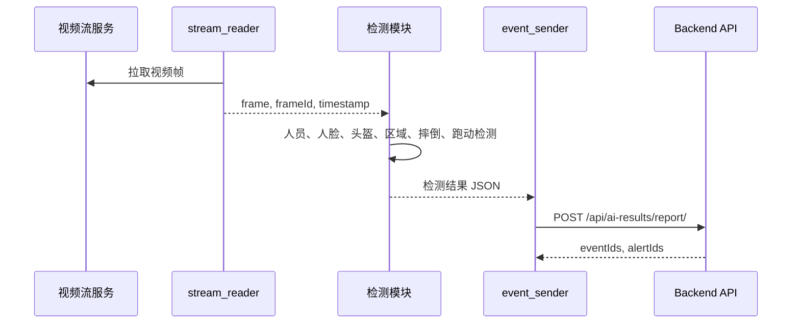

# AI 服务设计

## 当前状态

`ai-service` 当前提供 FastAPI 健康检查接口、自动 OpenAPI 文档和 AI 模块骨架。异常行为识别相关模块已提供规则型本地实现，包括人员检测结果格式化、头盔异常结果格式化、危险区域 footPoint 判断、摔倒宽高比判断、异常跑动连续帧速度判断，以及 AI 结果上报客户端。真实 YOLO 模型加载、视频帧读取、人脸识别推理仍为 `planned`。

## 服务职责

AI 服务负责从视频流中读取帧数据，执行人员检测、人脸识别、头盔检测、危险区域检测、摔倒检测、异常跑动检测，并将结构化结果通过后端 API 上报。AI 服务不直接写数据库。

## 模块结构

| 模块 | 文件 | 职责 | 当前状态 |
| --- | --- | --- | --- |
| `stream_reader` | `modules/stream_reader.py` | 读取 RTSP/RTMP/HLS 视频流和视频帧 | placeholder |
| `person_detector` | `modules/person_detector.py` | 基于 YOLO 检测人员位置，并提供 `PERSON_DETECTION` 结果格式化 | partial implemented |
| `face_recognition_service` | `modules/face_recognition_service.py` | 加载人脸库并识别人脸身份 | placeholder |
| `helmet_detector` | `modules/helmet_detector.py` | 检测头盔佩戴状态，并提供 `HELMET_WARNING` 结果格式化 | partial implemented |
| `zone_detector` | `modules/zone_detector.py` | 基于人员 footPoint、区域多边形和安全距离判断区域风险 | partial implemented |
| `fall_detector` | `modules/fall_detector.py` | 基于 trackId 连续帧历史和人体框宽高比判断摔倒风险 | partial implemented |
| `running_detector` | `modules/running_detector.py` | 基于 trackId 连续帧中心点和时间戳判断异常跑动 | partial implemented |
| `abnormal_behavior_service` | `modules/abnormal_behavior_service.py` | 聚合异常行为检测结果并生成 AI 上报 payload | partial implemented |
| `event_sender` | `modules/event_sender.py` | 将检测结果上报到后端 `/api/ai-results/report/` | partial implemented |

## 模块输入输出

| 模块 | 输入 | 输出 |
| --- | --- | --- |
| `stream_reader` | 摄像头流地址、重连参数 | 视频帧、帧 ID、时间戳 |
| `person_detector` | 单帧图片 | 人员 bbox、置信度、trackId |
| `face_recognition_service` | 人脸区域图片、员工人脸库 | employeeId、相似度、识别状态 |
| `helmet_detector` | 单帧图片、人员 bbox | 是否佩戴头盔、置信度 |
| `zone_detector` | 人员 footPoint、区域多边形、安全距离 | 入侵状态、区域 ID、距离 |
| `fall_detector` | trackId 连续帧历史、人体框或姿态 | 摔倒状态、置信度 |
| `running_detector` | trackId 连续帧中心点、时间戳 | 异常跑动状态、速度、持续帧数 |
| `abnormal_behavior_service` | 摄像头 ID、帧 ID、人员检测结果、trackId 历史、区域配置 | 符合 `/api/ai-results/report/` 的 AI 上报 payload |
| `event_sender` | 检测结果 JSON、后端 API 地址 | 上报结果、事件 ID、告警 ID |

## 通用检测结果格式

```json
{
  "cameraId": 1,
  "frameId": "frame-0001",
  "timestamp": "2026-07-07T10:00:00+08:00",
  "results": []
}
```

## 人员检测输出

```json
{
  "type": "PERSON_DETECTION",
  "trackId": "t-1",
  "bbox": {
    "x1": 100,
    "y1": 120,
    "x2": 240,
    "y2": 420
  },
  "centerPoint": {
    "x": 170,
    "y": 270
  },
  "footPoint": {
    "x": 170,
    "y": 420
  },
  "confidence": 0.94
}
```

## 人脸识别输出

```json
{
  "type": "FACE_RESULT",
  "trackId": "t-1",
  "employeeId": 1,
  "employeeNo": "E001",
  "name": "张三",
  "matched": true,
  "similarity": 0.91,
  "faceBox": {
    "x1": 120,
    "y1": 130,
    "x2": 190,
    "y2": 210
  }
}
```

陌生人识别输出：

```json
{
  "type": "FACE_RESULT",
  "trackId": "t-2",
  "employeeId": null,
  "matched": false,
  "label": "unknown",
  "similarity": 0.32
}
```

## 头盔检测输出

```json
{
  "type": "HELMET_WARNING",
  "trackId": "t-1",
  "helmetStatus": "no_helmet",
  "confidence": 0.88,
  "level": "medium"
}
```

## 摔倒检测输出

```json
{
  "type": "FALL_ALERT",
  "trackId": "t-1",
  "isFall": true,
  "confidence": 0.86,
  "durationFrames": 8,
  "level": "high"
}
```

## 异常跑动输出

```json
{
  "type": "RUNNING_ALERT",
  "trackId": "t-1",
  "isRunning": true,
  "pixelSpeed": 42.6,
  "threshold": 30,
  "durationFrames": 6,
  "level": "medium"
}
```

异常跑动不是 YOLO 原生能力。YOLO 只能提供人员检测框，异常跑动需要基于以下信息二次判断：

1. `trackId`: 跨帧跟踪同一人员。
2. 连续帧中心点: 记录 bbox 中心点或 footPoint。
3. 像素速度: 根据点位位移和帧时间差计算。
4. 连续帧阈值: 只有连续多帧超过速度阈值才判定为异常跑动。
5. 场景校准: 不同摄像头视角下速度阈值需要独立配置。

## 危险区域判断输出

```json
{
  "type": "ZONE_WARNING",
  "trackId": "t-1",
  "zoneId": 3,
  "zoneName": "危险设备区",
  "footPoint": {
    "x": 170,
    "y": 420
  },
  "inside": true,
  "distance": 0,
  "safeDistance": 20,
  "level": "high"
}
```

危险区域检测需要前端在画面上绘制多边形区域，并保存区域坐标。AI 服务根据人员 `footPoint` 判断：

1. `footPoint` 是否位于多边形内部。
2. `footPoint` 到区域边界的距离是否低于安全距离。
3. 是否需要结合摄像头透视关系进行阈值校准。

不应只使用 bbox 中心点判断区域入侵，因为人员脚底位置更能代表人员实际站立点。

## AI 上报流程



## 异常处理

| 场景 | 处理方式 |
| --- | --- |
| 视频流断开 | 重连并上报摄像头离线状态 |
| 模型加载失败 | 服务启动失败或降级为不可用状态 |
| 后端上报失败 | 重试并记录本地错误日志 |
| 检测结果格式错误 | 丢弃异常结果并记录 frameId |
| 摄像头未配置区域 | 跳过区域检测 |
