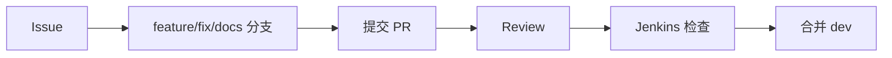

# 团队分工

## 分工原则

团队按模块边界协作。每个成员优先修改自己负责范围，跨模块改动需要提前沟通，并在 PR 中说明原因、影响范围和验证方式。

## 成员 1：组长 / 产品 / 文档 / OpenSpec / 视频流负责人

| 项 | 内容 |
| --- | --- |
| 主要职责 | 项目范围管理、需求拆分、文档维护、OpenSpec 管理、视频流方案选型和接入协调 |
| 交付物 | PRD、OpenSpec、项目总览、视频流配置说明、团队任务拆分 |
| 对接对象 | 全体成员、测试部署负责人 |
| 验收标准 | 文档结构完整，需求范围清晰，视频流方案可被前端和 AI 服务消费 |

## 成员 2：AI 算法负责人-人脸识别

| 项 | 内容 |
| --- | --- |
| 主要职责 | 人脸录入、人脸特征提取、人脸库加载、员工识别、陌生人判断 |
| 交付物 | 人脸识别模块、输入输出格式、模型依赖说明、识别测试用例 |
| 对接对象 | 后端负责人、前端负责人、成员 1 |
| 验收标准 | 可输出 employeeId、similarity、matched 状态，陌生人可触发事件和告警流程 |

## 成员 3：AI 算法负责人-异常行为检测

| 项 | 内容 |
| --- | --- |
| 主要职责 | 人员检测、头盔检测、摔倒检测、异常跑动检测、危险区域判断 |
| 交付物 | 检测模块、trackId 处理说明、阈值配置、检测 JSON 输出 |
| 对接对象 | 后端负责人、前端负责人、成员 1 |
| 验收标准 | 检测输出符合 `06-ai-service-design.md`，异常跑动基于连续帧速度判断，区域入侵基于 footPoint 判断 |

## 成员 4：后端负责人

| 项 | 内容 |
| --- | --- |
| 主要职责 | Django API、数据库模型、认证权限、事件日志、告警中心、AI 上报入口 |
| 交付物 | REST API、WebSocket 实现、数据库 migration、Swagger 文档 |
| 对接对象 | 前端负责人、AI 算法负责人、测试部署负责人 |
| 验收标准 | API 符合统一返回格式，AI 上报能生成事件和告警，前端不需要直连数据库 |

## 成员 5：前端负责人

| 项 | 内容 |
| --- | --- |
| 主要职责 | Vue 页面、路由、监控大屏、告警中心、员工和摄像头管理页面 |
| 交付物 | 页面实现、组件拆分、API 调用封装、WebSocket 消费逻辑 |
| 对接对象 | 后端负责人、AI 算法负责人、成员 1 |
| 验收标准 | 页面可访问，实时监控布局完整，REST API 和 WebSocket 消费符合文档 |

## 成员 6：测试 / Jenkins / 部署负责人

| 项 | 内容 |
| --- | --- |
| 主要职责 | 测试计划、接口测试、视频流测试、Jenkins Pipeline、本地和演示部署 |
| 交付物 | 测试用例、测试报告、Jenkins 配置、部署说明、常见问题排查 |
| 对接对象 | 全体成员 |
| 验收标准 | Jenkins 能完成检查和构建，测试覆盖核心闭环，部署步骤可复现 |

## 协作流程

## 合并规则

1. 所有改动先进入个人功能分支。
2. PR 目标分支为 `dev`。
3. Jenkins 通过后才能合并。
4. 涉及接口、数据库、AI 输出或页面路径的 PR 必须更新文档。
5. 不得未经沟通修改其他成员负责模块。
