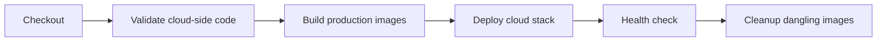

# 部署与 CI/CD

## 部署边界

当前部署分为两部分：

- 云端：PostgreSQL、Django/Daphne Backend、Nginx Frontend，由 Jenkins 和 `deploy/docker-compose.prod.yml` 部署。
- AI 主机：AIService、CUDA/模型、OpenCV 和 FFmpeg，使用仓库 Python 3.11 环境独立运行并连接云端 Backend/SRS。

SRS 作为独立视频基础设施运行，不由当前生产 Compose 创建。

## 本地环境

| 服务 | 固定运行时 | 默认端口 |
| --- | --- | --- |
| Backend | `backend/.venv/Scripts/python.exe` | 8000 |
| AIService | `ai-service/.venv/Scripts/python.exe`，Python 3.11 | 9000 |
| Frontend | 项目 Node/npm | 5173 |

启动完整本地栈：

```powershell
powershell -ExecutionPolicy Bypass -File .\scripts\check-python-env.ps1
powershell -ExecutionPolicy Bypass -File .\scripts\start-local-dev.ps1
```

停止脚本管理的进程：

```powershell
powershell -ExecutionPolicy Bypass -File .\scripts\stop-local-dev.ps1
```

不要为 AIService 创建其他虚拟环境，不要使用系统 Python 或 Python 3.14。

## 数据库

本地默认使用 `backend/db.sqlite3`：

```powershell
backend\.venv\Scripts\python.exe backend\manage.py migrate
backend\.venv\Scripts\python.exe backend\manage.py seed_dev_data
```

生产使用 PostgreSQL 16，并通过 `deploy/.env.prod` 注入数据库、Django、域名和跨域配置。模板见 `deploy/.env.prod.example`。生产密钥和密码不得提交仓库。

## 视频流

典型演示链路：

| 用途 | 示例 |
| --- | --- |
| 原始 RTMP | `rtmp://<srs-host>:1935/live/1` |
| AI 带框 RTMP | `rtmp://<srs-host>:1935/live/1_detected` |
| WebRTC/HTTP-FLV | 由摄像头配置和前端环境变量提供 |

AIService 主机必须能访问 SRS RTMP、Backend HTTPS API，并提供可执行的 `ffmpeg`。前端浏览器需要能访问 Backend、WebSocket 以及 SRS 播放端口。

## Jenkins Pipeline



流水线执行以下工作：

1. 校验 `deploy/.env.prod` 与生产 Compose 配置。
2. 执行前端 `npm ci` 和 `npm run build`。
3. 执行 Backend `manage.py check`。
4. 构建 Frontend、Backend 生产镜像。
5. 启动/更新 PostgreSQL、Backend、Frontend。
6. 在 Backend 容器内执行 migration 和 collectstatic。
7. 检查 Compose 服务及 HTTP 健康状态。
8. 清理 dangling images。

AIService 不在云端流水线构建或重启，避免覆盖本地 GPU、模型和流配置。

## 生产健康检查

- Frontend：站点首页返回 2xx。
- Backend：`/api/health/` 返回健康状态。
- Swagger：`/api/docs/` 可访问（是否对公网开放按部署策略决定）。
- Database：PostgreSQL `pg_isready` 通过。
- AIService：本地主机 `/health` 与 `/streams/status` 正常。
- 视频：SRS 同时存在原始流和带框流，浏览器 WebRTC/HTTP-FLV 可播放。

## 回滚与排查

生产部署、数据库备份、回滚命令与 Nginx 配置说明见 [生产部署指南](guides/production-deployment.md)。常见排查顺序：

1. 确认 Backend 和 Frontend 容器健康。
2. 确认浏览器 API/WebSocket 无跨域或证书错误。
3. 确认手机原始 RTMP 持续存在。
4. 确认 AIService `/streams/status` 没有输入断流或 writer 错误。
5. 确认 SRS 带框流存在以及 WebRTC/HTTP-FLV 地址匹配。

根目录 `docker-compose.yml` 仅作通用开发参考，其中 AIService 容器不包含已验证的本地 CUDA/Python 3.11 组合，不能替代推荐启动脚本。
